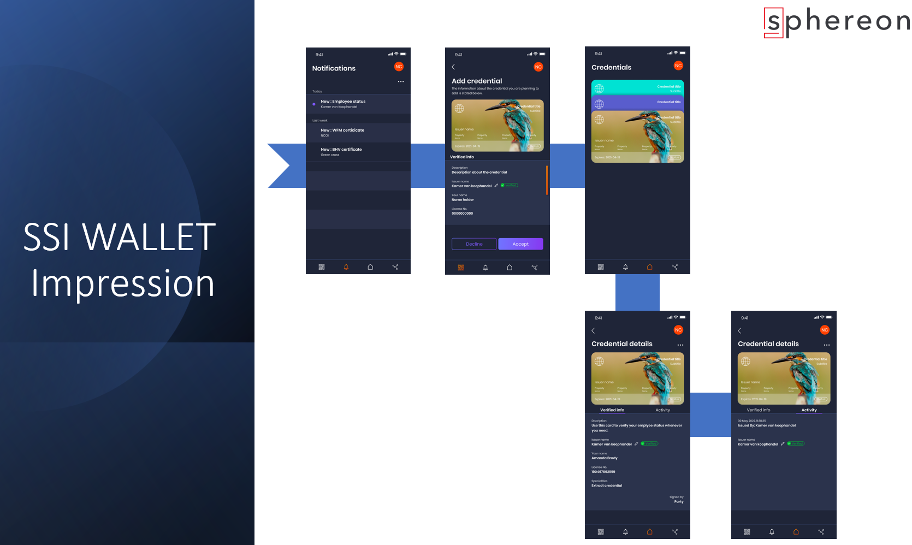
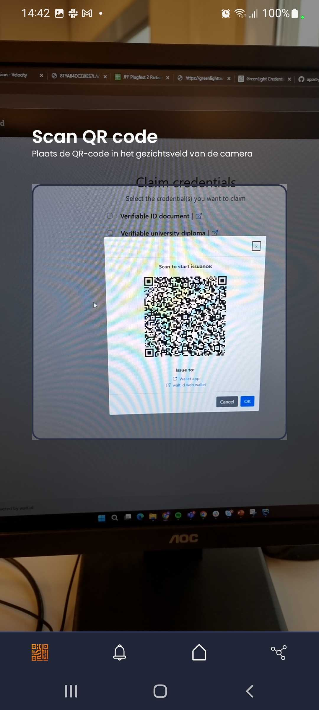
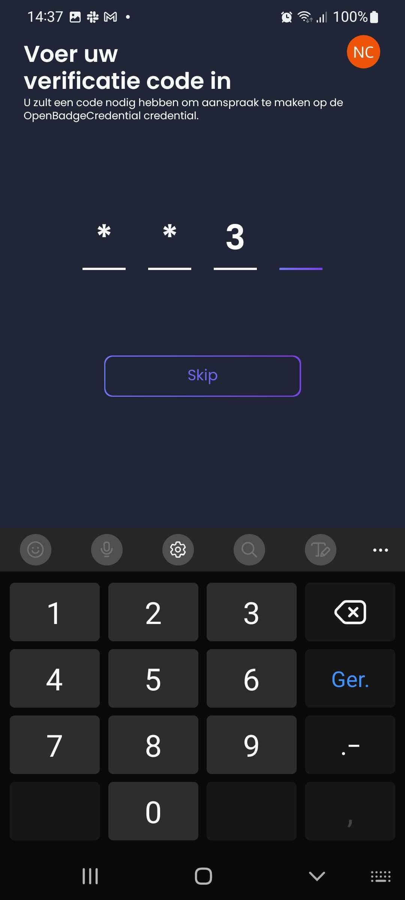
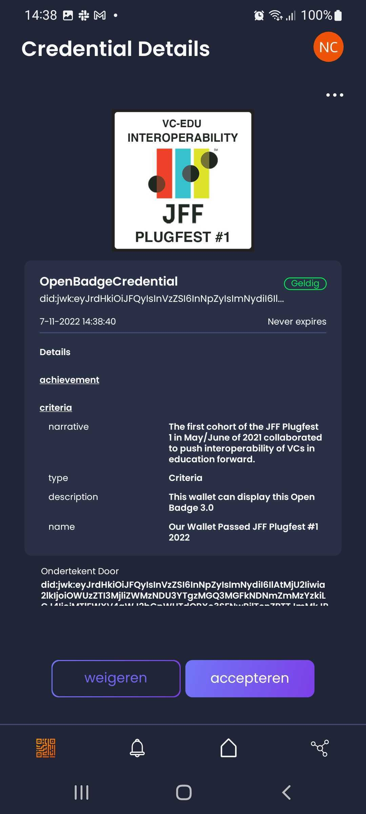
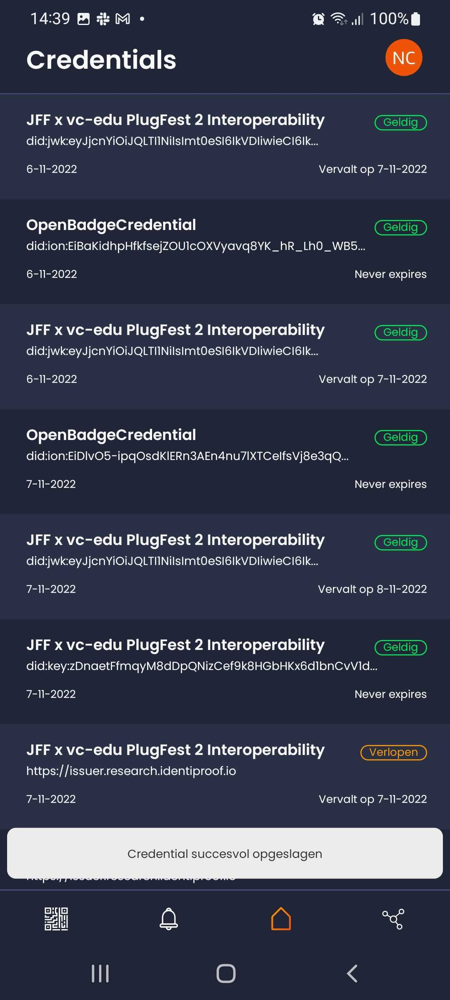
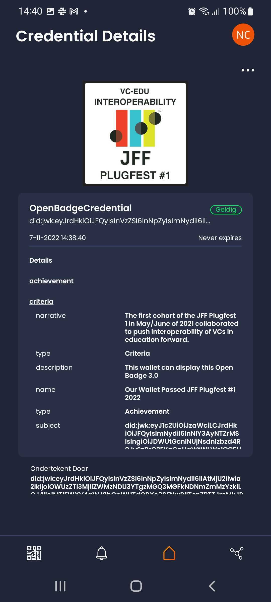
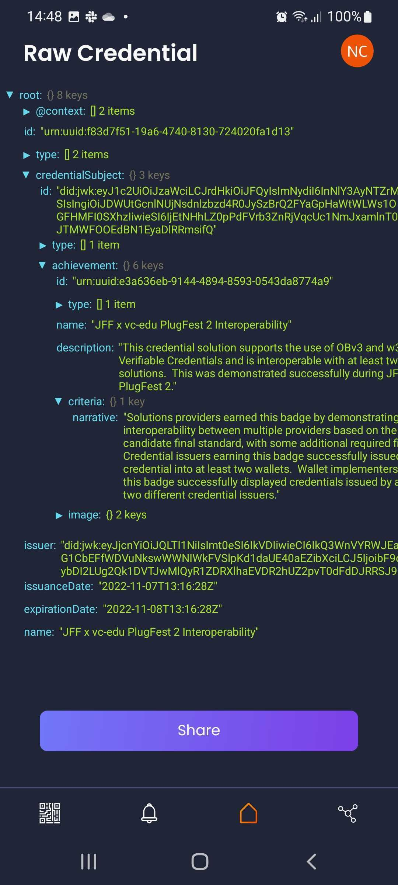
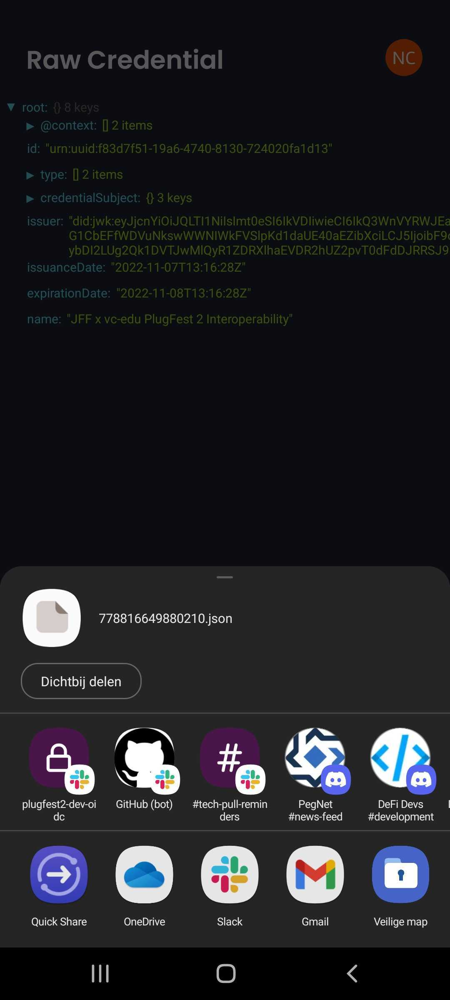

<!--suppress HtmlDeprecatedAttribute -->
<h1 align="center">
  <br>
  <a href="https://www.sphereon.com"></a>
  <br>SSI Wallet (react-native)
  <br>
</h1>

---

__Warning: The wallet is currently in a pre-alpha stage and far from complete. Breaking changes without notice will
happen at this point!__

---

# Sphereon Wallet

An Open-Source SSI wallet with support for Decentralized Identifiers that can receive W3C Verifiable Credentials from
Issuers and Present them to Verifiers.

The wallet is build using our [SSI-SDK](https://github.com/Sphereon-Opensource/ssi-sdk), which you can use to create
Issuer and Verifier agents as well as mobile and web wallets.



The wallet supports or soon will the following features:

- [W3C JWT and LDP/JSON-LD](https://www.w3.org/TR/vc-data-model/) credentials
- [DID](https://www.w3.org/TR/did-core/) methods: ion, jwk, key, web, ethr, lto, factom, accumulate, cheqd
- Uniform rendering and representation library
- Card/Graphical and textual views
- [Presentation Exchange](https://github.com/Sphereon-Opensource/pex)
- [Credential Manifest](https://identity.foundation/credential-manifest/)
- [Well-known DIDs (domain linkage of DIDs)](https://identity.foundation/.well-known/resources/did-configuration/)
- [Self Issued Open ID Connect V2 (SIOPv2)](https://github.com/Sphereon-Opensource/did-auth-siop)
- [OpenID for Verifiable Credential Issuance (OpenID4VCI)](https://github.com/Sphereon-Opensource/OID4VCI-client)
- [OpenID for Verifiable Presentations (OpenID4VP)](https://openid.net/specs/openid-4-verifiable-presentations-1_0.html)
- [DIDComm messaging v2](https://identity.foundation/didcomm-messaging/spec/) & [WACI DIDComm](https://identity.foundation/waci-didcomm/)
- [JWT VC Presentation Profile](https://identity.foundation/jwt-vc-presentation-profile/)
- [VC API](https://w3c-ccg.github.io/vc-api/) and [CHAPI](https://chapi.io/)
- [Mnemonic seed and key derivation with backup](https://github.com/Sphereon-Opensource/ssi-sdk/tree/develop/packages/mnemonic-seed-manager)
- [Microsoft Entra Verified ID integration](https://www.microsoft.com/en-us/security/business/identity-access/microsoft-entra-verified-id)
- [Sphereon VDX Platform integration](https://sphereon.com/sphereon-vdx-verifiable-data-exchange/)

## OpenID for Verifiable Credential Issuance (OID4VCI) Demo flow

Please note that the below flow was created as part of
the [JFF/W3C-EDU plugfest 2](https://w3c-ccg.github.io/vc-ed/plugfest-2-2022/) and is showing an older design of the
wallet.

To get a credential issued to the wallet,
using [OpenID for Verifiable Credential Issuance (OpenID4VCI)](https://openid.net/specs/openid-4-verifiable-credential-issuance-1_0.html)
the following steps can be followed.
The below issuer systems were part of the [JFF/W3C-EDU plugfest 2](https://w3c-ccg.github.io/vc-ed/plugfest-2-2022/) to
show interop for OpenID4VCI.

1. Launch the wallet
2. Navigate to the QR reader at the bottom left.
3. Scan one of the QR codes of the following issuers:
    * Spruce - https://ngi-oidc4vci-test.spruceid.xyz
    * Walt.id - https://jff.walt.id
    * Danubetech - https://oidc4vc.uniissuer.io/
    * Mattr - https://launchpad.mattrlabs.com/
    * Crossword Cybersecurity - https://idp.research.identiproof.io (user: user, password: password)
    * Diwala - https://oidc4vc.diwala.io/issue
    * Entrustient - https://oidc.entrustient.net/staging/oidc4vci/credential/946270

   <br>
   
4. If asked, enter the given pin code
   <br>
   
5. Review the and accept the credential
   <br>
   
6. Choose the issued credential in the list of credentials
   <br>
   
7. Press the '…' (meatballs) button to display the raw credential
   <br>
   
8. Share the raw credential by pressing the ‘share’ button
   <br>
   
9. Choose your preferred app to share the raw credential
   <br>
   

# License

Please note that this wallet is licensed as GPLv3, meaning restrictions apply. Sphereon does offer commercial licenses
without these restrictions. The wallet is mainly build around our SSI-SDK which is more liberal licensed. We chose this
approach to protect the IP and designs of the wallet a bit more.

# Developers

## Utility scripts

There are several other utility scripts that help with development.

* `yarn fix:lint` - runs `eslint --fix` to fix code style.
* `yarn fix:prettier` - runs `prettier --write` to fix code style.

## Requirements

SSI Wallet uses Expo SDK v48 and React-Native v0.71.

* Node v16.x.x
* Expo CLI v6.0.1 or above
* Yarn

### Node

Use a nvm (Node Version Manager) or directly install a LTS version of NodeJS. The version of NodeJS should be 16.x.x
which is required for RN 0.71 to work. The app is not guaranteed to work with higher Node versions and it will
certainly not work with lower Node versions.

Use <code>nvm list available</code>  to list the available versions of Node.

Then install and make it the default. Please ensure you have proper permissions. On Windows this can mean running the
command prompt or powershell as administrator!

Example:

```shell
nvm install 16.19.0
nvm use 16.19.0
```

You can use the following command to check the node version.

```shell
nvm current
```

<b>NOTE</b>: After installation be sure to close the terminal window. If installed from your IDE, be sure to close the
IDE and start it (do not restart, as it might not pick up the latest environment variables)

### Yarn

We use Yarn as package manager. Install it with the following command:

```shell
npm install --global yarn
```

<b>NOTE</b>: After installation be sure to close the terminal window. If installed from your IDE, be sure to close the
IDE and start it (do not restart, as it might not pick up the latest environment variables)

## Starting the SSI-Wallet

The SSI-Wallet can be started by running one of the following commands.

### Android

```shell
expo android:start
```
For Android you need to make sure that your wallet is connect using a USB cable and that developer options are enabled. If you do not connect the phone using USB it will start the Android emulator instead

By default, it uses port 8081.

* Ensure your phone and your development computer are on the same (Wi-Fi) network.
* Ensure you phone is connected via USB
* Ensure the firewall on you computer allows incoming traffic on port 8081.


### iOS
You will have to use Xcode directly fow now. We will work on getting the below command working.

```shell
expo ios:start  // Please note this command currently doesn't work
```

Run the below commands on the command line to update all dependencies.
````shell
yarn install
cd ios
pod install
````
In XCode select the `Product -> Run` option from the menu. (If you want to create a archive for instance for TestFlight, you can choose `Product -> Archive`).
It will take some time for the app to start. In some circumstances you might not get directly to the app. If that is the
case lookup whether the Sphereon Wallet application can be found in you apps. If so start it from there. You should see the
bundler starting.
