<!--suppress HtmlDeprecatedAttribute -->
<h1 align="center">
  <br>
  <a href="https://www.sphereon.com"></a>
  <br>Mobile Wallet (iOS/Android)
  <br>
</h1>

---

<h3>Warning: The wallet is currently in a beta stage and still incomplete</h3>
Certain functionality might not be available yet
<br/>
<br/>

<div>
<a href='https://apps.apple.com/us/app/sphereon-wallet/id1661096796'></a>
<br/>
<a href='https://play.google.com/store/apps/details?id=com.sphereon.ssi.wallet&pcampaignid=pcampaignidMKT-Other-global-all-co-prtnr-py-PartBadge-Mar2515-1'></a></div>

# Table of content:

- [Introduction and technology](#sphereon-wallet)
- [Onboarding](#onboarding)
- [Receiving a Credential from an Issuer](#receiving-credentials-from-an-issuer)
- [Sharing a Credential with a Verifier](#sharing-credentials-with-a-verifier)

- [Developer information](#developers)
- [License](#license)

# Sphereon Wallet

The Sphereon Wallet is a new breed of open standards, open-source, privacy-preserving applications, that gives you full
and sole control over your own information. It enables you to manage your own data.

## Introduction

Your data is stored nowhere else but on your phone. Nobody else will have access unless you decide to share it with
them. Only you decide if you want to share your data with someone else.

The Sphereon Wallet is build around [W3C Decentralized Identifiers](https://www.w3.org/TR/did-core/) and can
receive [W3C Verifiable Credentials](https://www.w3.org/TR/vc-data-model/) from Issuers and present them to Verifiers.

The wallet is build using our Apache2 open-source licensed [SSI-SDK](https://github.com/Sphereon-Opensource/ssi-sdk) and
its [key/DID extensions](https://github.com/Sphereon-Opensource/SSI-SDK-crypto-extensions), which you can use to create
Issuer and Verifier agents as well as mobile and web wallets.


## Technologies supported

The wallet supports or soon (\*) will the following features:

- [W3C JWT and LDP/JSON-LD](https://www.w3.org/TR/vc-data-model/) credentials
- [DID](https://www.w3.org/TR/did-core/) methods: ion, jwk, key, web, ethr<sup>_</sup>,
  cheqd <sup>_</sup>, ebsi<sup>\*</sup>
- Uniform rendering and representation library<sup>\*</sup>
- Card/Graphical and textual views<sup>\*</sup>
- [Presentation Exchange](https://github.com/Sphereon-Opensource/pex)
- [Credential Manifest](https://identity.foundation/credential-manifest/)<sup>\*</sup>
- [Well-known DIDs (domain linkage of DIDs)](https://identity.foundation/.well-known/resources/did-configuration/)
- [Self Issued Open ID V2 (SIOPv2)](https://github.com/Sphereon-Opensource/did-auth-siop)
- [OpenID for Verifiable Credential Issuance (OID4VCI)](https://github.com/Sphereon-Opensource/OID4VCI-client)
- [OpenID for Verifiable Presentations (OID4VP)](https://openid.net/specs/openid-4-verifiable-presentations-1_0.html)
- [DIDComm messaging v2](https://identity.foundation/didcomm-messaging/spec/)<sup>
  _</sup> & [WACI DIDComm](https://identity.foundation/waci-didcomm/)<sup>_</sup>
- [JWT VC Presentation Profile](https://identity.foundation/jwt-vc-presentation-profile/)
- [VC API](https://w3c-ccg.github.io/vc-api/)<sup>\*</sup> and [CHAPI](https://chapi.io/)
- [Mnemonic seed and key derivation with backup](https://github.com/Sphereon-Opensource/ssi-sdk/tree/develop/packages/mnemonic-seed-manager)
- [Microsoft Entra Verified ID integration](https://www.microsoft.com/en-us/security/business/identity-access/microsoft-entra-verified-id)
- [Sphereon VDX Platform integration](https://sphereon.com/sphereon-vdx-verifiable-data-exchange/)

# Onboarding

Since the Wallet is a so-called Self Sovereign Identity Wallet, no information you provide during the onboarding will be
shared with any external. That includes the developer (Sphereon) of the Wallet. You will always be asked when receiving
or sharing data with external systems. The user details you provide during the onboarding are used for personalization,
supporting multiple profiles and future features of the Wallet. There is no e-mail validation or external system
involved.

## The onboarding process

1. Launch the Sphereon Wallet
2. Once you start the Sphereon Wallet the first time you will be greeted by the Welcome screen:

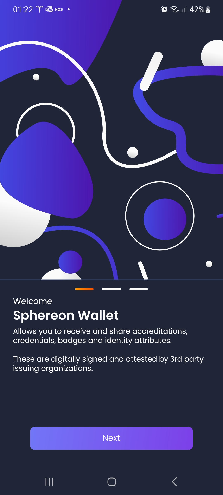

3. Click the button at the bottom and read the Welcome texts.
4. After clicking the button at the bottom on the 3rd screen you will go to the Terms and Conditions screen:

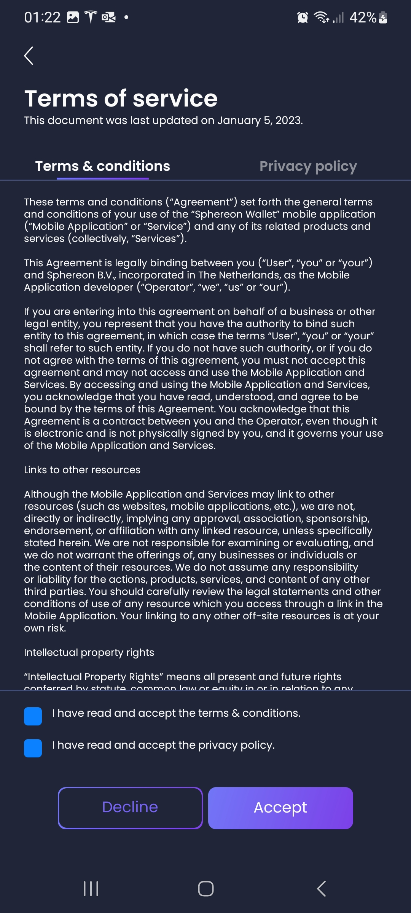

5. Make sure to enable boxes at the bottom, otherwise you will not be able to use the wallet
6. After clicking Accept you will go to the Personal Details screen:

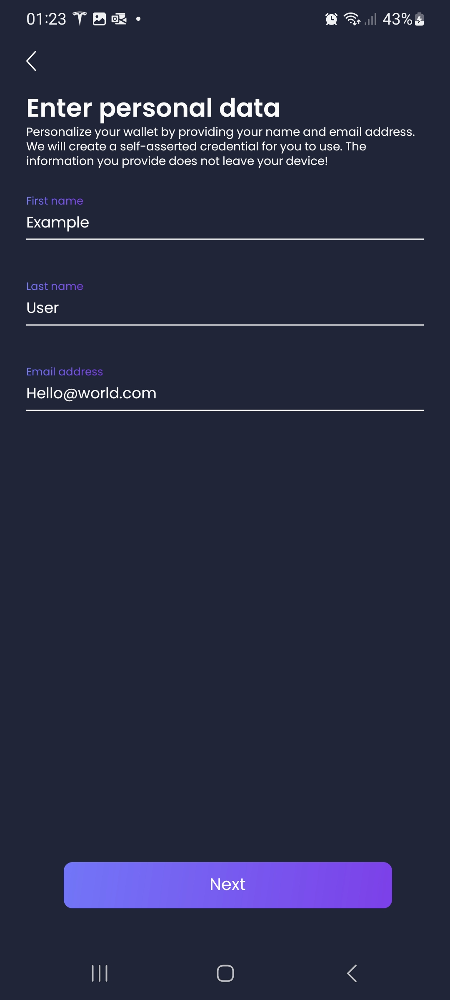

7. Fill out your personal details to personalize the wallet. No information will be shared! Click on Next:

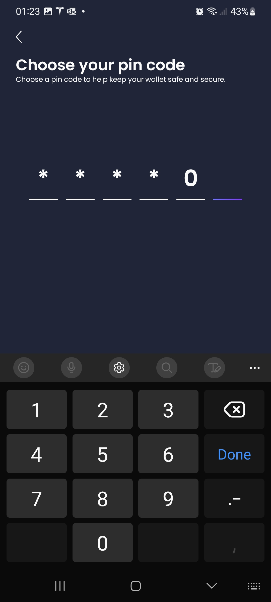

8. Enter a pincode which you need to remember (right now there is no way to recover your pincode!). After you entered 6
   digits you will go to the verify pincode screen:

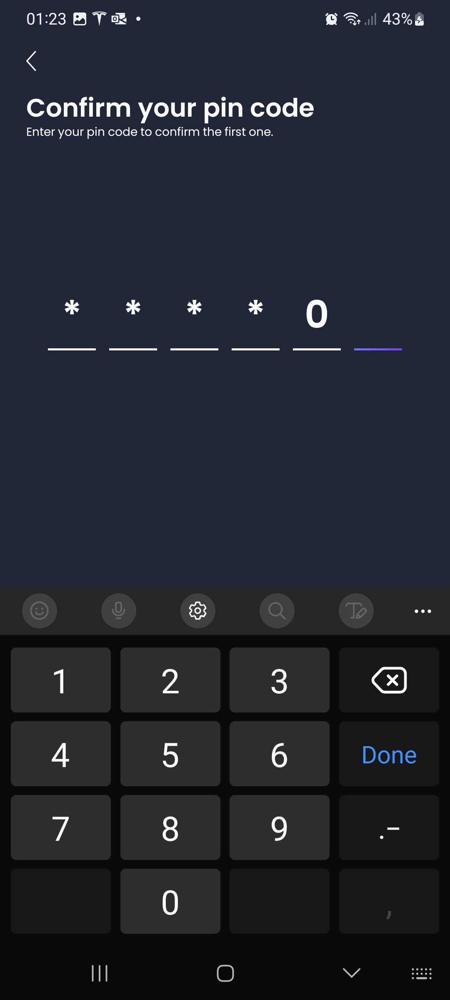

9. After having entered the pincode a 2nd time for verification, you will go to the Personal Details overview screen:

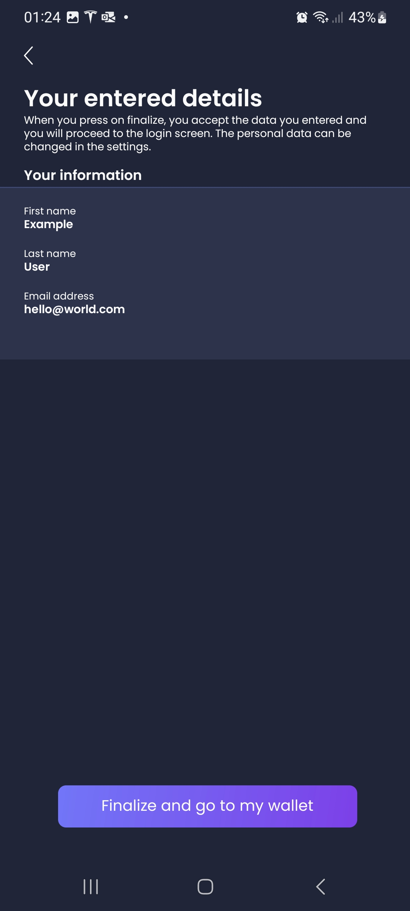

9. Review the details and go back to previous screens if you have made an error. If everything is okay click on the "
   Finalize and go to my wallet" button.
10. The wallet is being setup and a loading screen appears:


11. You will now enter the general Verifiable Credential Overview screen:

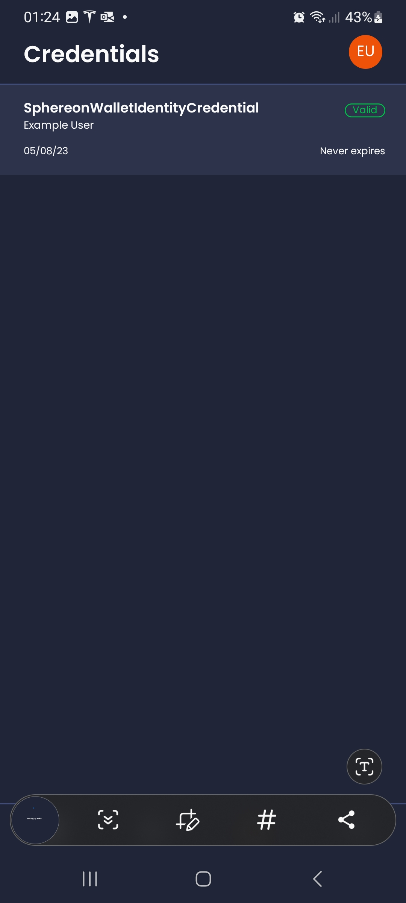

12. Congratulations. You have successfully onboarded, and you have created a first self-asserted Verifiable Credential
    using the Wallet.

# Receiving Credentials from an Issuer

You can receive Verifiable Credential from so called issuers. The wallet has support for multiple open standards to get
these Credentials. Currently on the OpenID for Verifiable Credential Issuance standard is enabled.

## OpenID for Verifiable Credential Issuance (OID4VCI) process

The current wallet only supports the new OID4VCI specification for receipt of credentials. To get a credential issued to
the wallet,
using [OpenID for Verifiable Credential Issuance (OpenID4VCI)](https://openid.net/specs/openid-4-verifiable-credential-issuance-1_0.html)
the following steps can be followed.
The below issuer systems were part of the [JFF/W3C-EDU plugfest 2](https://w3c-ccg.github.io/vc-ed/plugfest-2-2022/) to
show interop for OpenID4VCI. Please note that the Verifiable Credentials issued by the below list are just for
demo/testing purposes.

1. Launch the wallet
2. Navigate to the QR reader at the bottom left.
3. Scan one of the QR codes of the following issuers:

These 4 links are Sphereon demo issuers, branded differently

- [Sphereon (branded credentials)](https://ssi.sphereon.com/demo/issuer/)
- [Dutch Blockchain Coalition (branded credentials)](https://ssi.dutchblockchaincoalition.org/demo/issuer/)
- [Future Mobility Alliance (branded credentials)](https://ssi.future-mobility-alliance.org/demo/issuer/)

Other issuers:

- [Diwala](https://oidc4vc.diwala.io/issue)
- [Walt.id](https://jff.walt.id) (<= has some issues in their environment currently (proofPurpose is missing))
- [Mattr](https://launchpad.mattrlabs.com/)

   <br>
   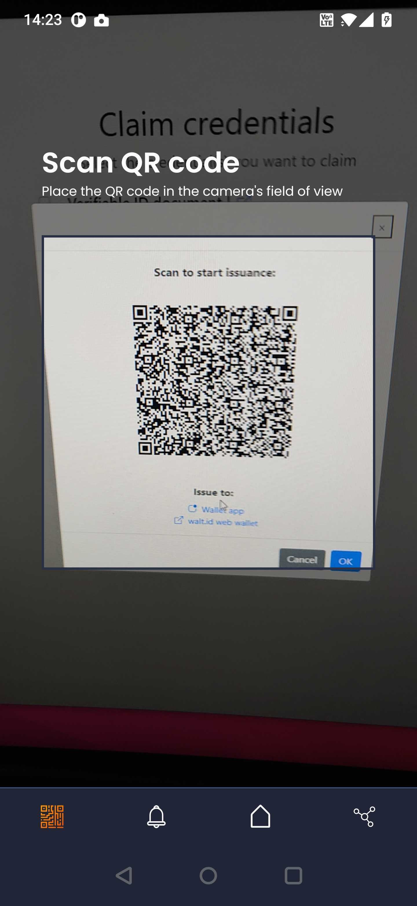

4. The first time you encounter an Issuer or Verifier system a Contact needs to be created. The Wallet will pre-fill a
   suggest name:


5. Please note that you have to press the Accept button and make sure the checkbox is enabled

6. Depending on whether the issuer supports issuing multiple credentials or not, you will have to make a selection. Note
   that the current wallet can only accept one credential at a time!

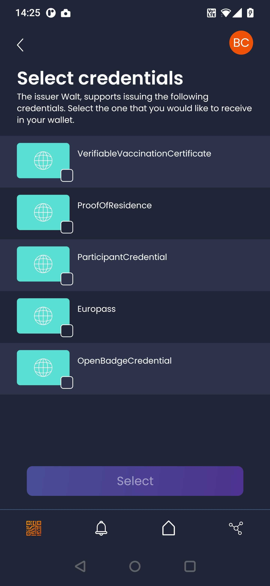

7. Depending on whether the issuer is requiring a Pincode you will have to enter a pincode. Note this is not the pincode
   of your wallet!:

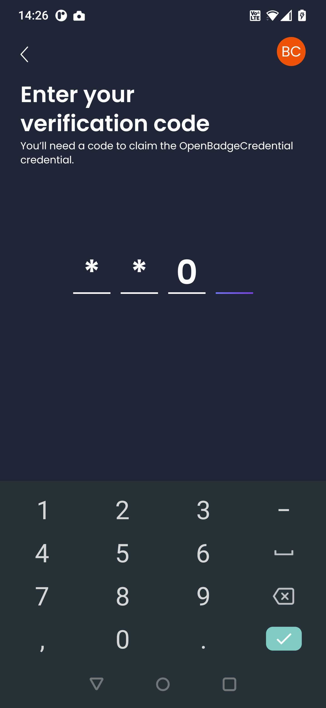

8. You now will go to the Credential Offer screen, which is showing you the offered Credential:

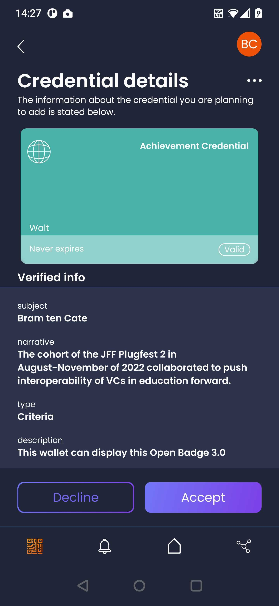

9. Review the Credential Offer and decide to either accept or decline the credential.
10. If you accept the offer you will go to the Verifiable Credenital Overview screen and you will see the following
    message:

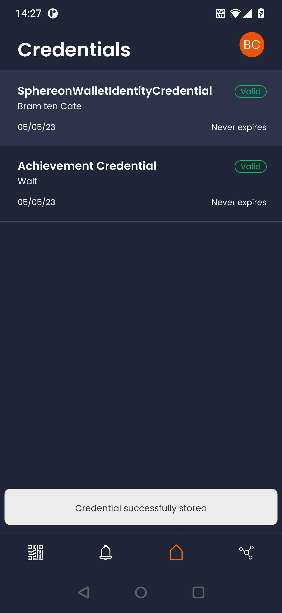

# Sharing Credentials with a Verifier

You can share Verifiable Credentials with so called Verifiers or Relying Parties. The wallet has support for multiple open standards to share
these Credentials. Currently on the OpenID for Verifiable Presentations standard is enabled.

## OpenID for Verifiable Presentations (OID4VP) process

The current wallet supports the new OID4VP specification for sharing credentials. To share a credential from the wallet with the Verifier,
using [OpenID for Verifiable Presentations (OID4VP)](https://openid.net/specs/openid-connect-4-verifiable-presentations-1_0-ID1.html)
the following steps can be followed.
Please note that the Verifiable Credentials shared with the below list should only be used for
demo/testing purposes.

1. Launch the wallet
2. Navigate to the QR reader at the bottom left.
3. Scan one of the QR codes of the following verifiers:

   - [Sphereon](https://ssi.sphereon.com/demo/verifier/) (needs the branded Sphereon credential from the Sphereon issuer)
   - [Dutch Blockchain Coalition](https://dutchblockchaincoalition.org/en/userlogin) (Use the login button/screen. It needs the branded DBC credential from the Dutch Blockchain Coalition issuer)
   - [Future Mobility Data Marketplace](https://marketplace.future-mobility-alliance.org/) (Use the login button top-right. It needs the branded FMDM credential from the Future Mobility Alliance issuer)
   - [Auth0](https://verifiablecredentials.dev/presentation) (change the uri: `"uri": "<CREDENTIAL_TYPE>"` to `"uri": "SphereonWalletIdentityCredential"`)

   <br>
   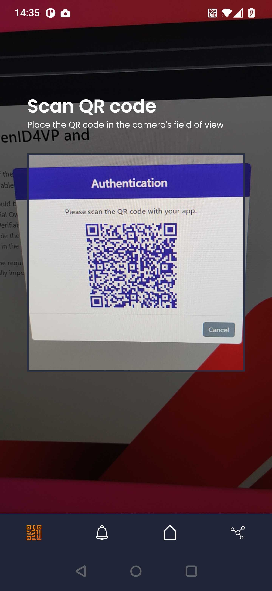

4. The first time you encounter an Issuer or Verifier system a Contact needs to be created. The Wallet will pre-fill a
   suggest name:

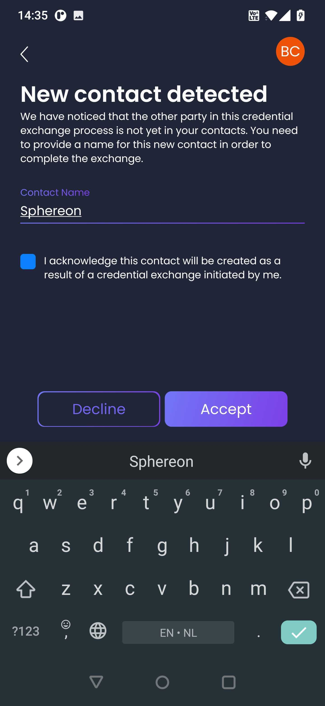

5. Please note that you have to press the Accept button and make sure the checkbox is enabled

6. You will now go to the overview screen from where you will have to select the required Verifiable Credentials from your wallet. An error will be displayed if the Verifier is asking information not present in your wallet

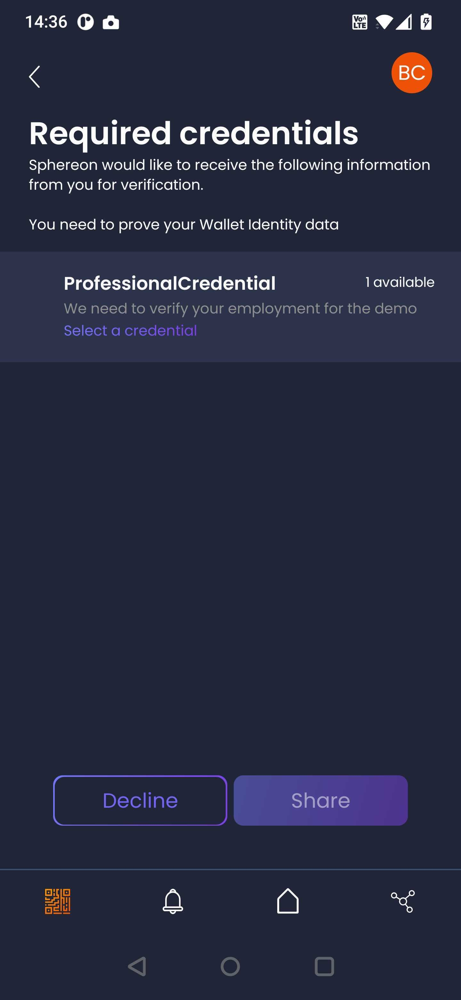

7. You need to click on the list items in the screen showing "Select a credential". The texts in these list items come from the Verifier and should provide you with hints on why the information is needed.
8. After you click on a single list-item for a specific input requirement, you will go to the overview screen of available Verifiable Credentials that can satisfy this requirement:

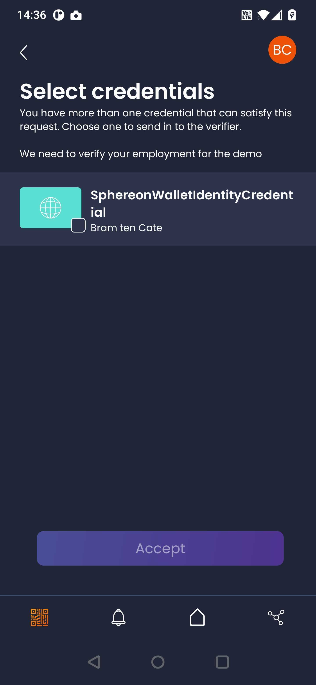

9. On the available credentials screen you can directly touch/select the Credential using the image or checkbox. Or you can click on the text next to it, to actually view the details of the Credential:

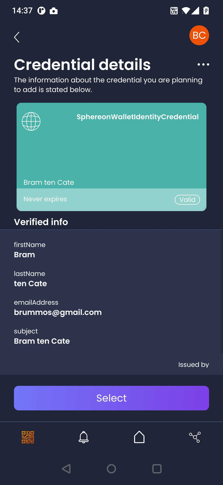

10. No matter what step you followed, you will now see 1 credential selected (the current wallet only supports 1 credential per input requirement, but does support multiple input requirements from a Verifier)

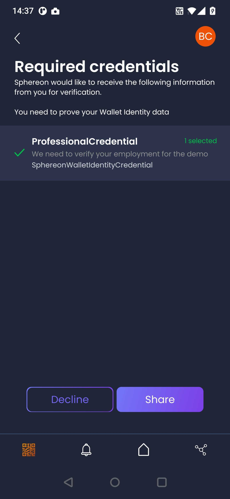

11. The share button should now be enabled and you should see a green checkmark next to the input requirement. Click on Share:

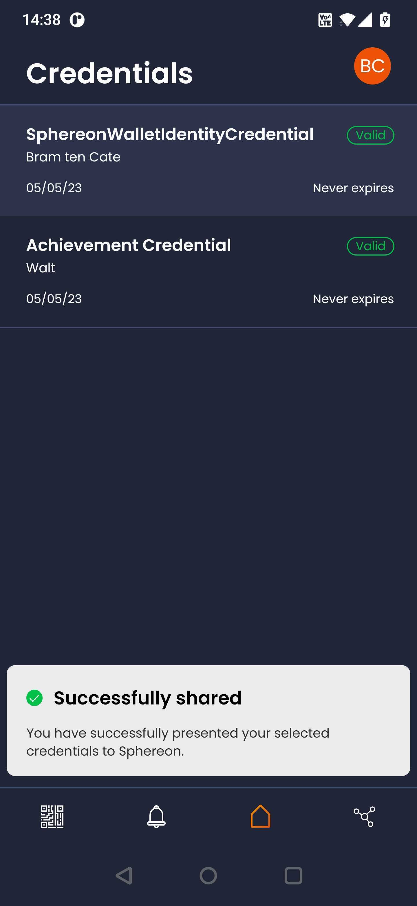

12. The credential has now been successfully shared with the Verifier. Typically the Verifier system will show you some message or change it's screen

# License

Please note that this wallet is licensed as Apache2.0. Sphereon also offers commercial licenses.

# Developers

## Utility scripts

There are several other utility scripts that help with development.

- `yarn fix:lint` - runs `eslint --fix` to fix code style.
- `yarn fix:prettier` - runs `prettier --write` to fix code style.

## Requirements

SSI Wallet uses Expo SDK v48 and React-Native v0.71.

- Node v20.x.x
- Expo CLI v6.0.1 or above
- Yarn

### Node

Use a nvm (Node Version Manager) or directly install a LTS version of NodeJS. The version of NodeJS should be 18.x.x
which is required for RN 0.71 to work. The app is not guaranteed to work with higher Node versions and it will
certainly not work with lower Node versions.

Use <code>nvm list available</code> to list the available versions of Node.

Then install and make it the default. Please ensure you have proper permissions. On Windows this can mean running the
command prompt or powershell as administrator!

Example:

```shell
nvm install 20
nvm use 20
```

You can use the following command to check the node version.

```shell
nvm current
```

<b>NOTE</b>: After installation be sure to close the terminal window. If installed from your IDE, be sure to close the
IDE and start it (do not restart, as it might not pick up the latest environment variables)

### Yarn

We use Yarn as package manager. Install it with the following command:

```shell
npm install --global yarn
```

<b>NOTE</b>: After installation be sure to close the terminal window. If installed from your IDE, be sure to close the
IDE and start it (do not restart, as it might not pick up the latest environment variables)

## Starting the SSI-Wallet

The SSI-Wallet can be started by running one of the following commands.

### Android

```shell
expo android:start
```

For Android you need to make sure that your wallet is connect using a USB cable and that developer options are enabled.
If you do not connect the phone using USB it will start the Android emulator instead

By default, it uses port 8081.

- Ensure your phone and your development computer are on the same (Wi-Fi) network.
- Ensure you phone is connected via USB
- Ensure the firewall on you computer allows incoming traffic on port 8081.

### iOS

You will have to use Xcode directly for now. We will work on getting the below command working.

```shell
expo ios:start  // Please note this command currently doesn't work
```

Run the below commands on the command line to update all dependencies.

```shell
yarn install
cd ios
pod install
```

In XCode select the `Product -> Run` option from the menu. (If you want to create a archive for instance for TestFlight,
you can choose `Product -> Archive`).
It will take some time for the app to start. In some circumstances you might not get directly to the app. If that is the
case lookup whether the Sphereon Wallet application can be found in you apps. If so start it from there. You should see
the bundler starting.
